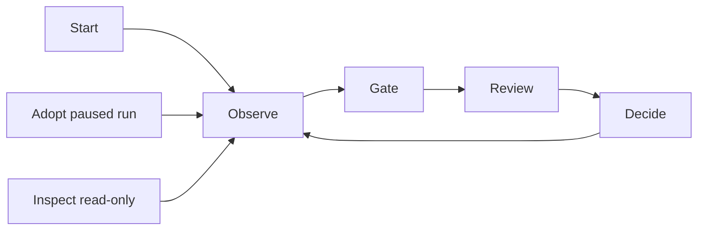

# 1. Introduction and Goals

| Field | Value |
|---|---|
| arc42 | 1. Introduction and Goals |
| Tier | 1 |

## Product promise

Workflow Cockpit gives an existing Spec Kit workflow user one local workspace in which to start a
workflow, adopt an existing paused run, or inspect an existing run read-only, observe its
execution, review worktree changes at gates, and submit the workflow's declared decision. It is a
standalone Python + Textual TUI, not a `specify` subcommand and not part of the Spec Kit repository.

The first release is valuable only when this complete single-run loop works, for a run Cockpit
started or one it adopted:

The Cockpit is not a status dashboard and does not aggregate runs. One invocation owns at most one
run in one project/worktree; it may list existing runs read-only, adopt one paused run, or inspect
an existing run read-only, but never holds more than one.

## Top quality goals

1. **Operational certainty.** The user can always identify the active branch, current workflow
   node, engine status, and available gate action.
2. **Responsiveness.** The UI never blocks: polling, process I/O, Git, and file reads stay off the
   render path and visible updates appear within 500 ms.
3. **Engine safety.** The engine is untouched: lifecycle writes use existing `specify` commands,
   reads use persisted run files, and no engine internals are imported.

## Stakeholders

| Stakeholder | Concern |
|---|---|
| Existing Spec Kit user | A complete start -> observe -> gate -> review -> decide loop in one terminal. |
| Repository maintainer | Agent-navigable intent and constraints; a codebase that stays simple. |
| External coding agent | Authoritative run context through the shipped `cockpit-run-context` skill. |

## Success criteria

- An existing Spec Kit user completes the full single-run loop without another terminal.
- Every installed compatible workflow can be started, and every declared gate can be submitted
  through the Cockpit.
- An existing paused run discovered in the project can be adopted and decided without starting a
  fresh engine run, and no run owned by a live foreign process is ever adopted.
- Normal exit and supported termination signals do not leave a Cockpit-owned workflow process
  running unattended.

## Functional requirements

| ID | Requirement |
|---|---|
| FR-1 | Discover the project root and installed workflows; present summary, steps, and schema-driven validated inputs; start and control exactly one run through engine CLI commands. |
| FR-2 | Render workflow state, review content, and engine output in one Textual app with one state-driven workspace, bounded read-only output, a graph with active path and attempts, timings, and polling at most every 500 ms. |
| FR-3 | Detect gates and show their message and declared options; show the feature directory's files before a decision; refresh live and support `$EDITOR`. |
| FR-4 | Write a stable context index and ship a dedicated skill that directs an external agent to authoritative live sources. |
| FR-5 | Confirm and submit every declared gate option without changing workflow semantics; prefer `verdict_input`; never send an unverified PTY decision twice; provide a separately confirmed Abort. |
| FR-6 | Confirm Abort on active exit; attempt bounded cleanup on catchable signals; handle success, failure, and abort; persist no Cockpit history. |
| FR-7 | Ship selectable styling templates that change only visual tokens and fall back to the neutral default without failing the run. |
| FR-8 | Discover existing runs under `.specify/workflows/runs/` with bounded reads; report unusable runs; adopt only a `paused` run through a single-owner claim and the persisted launch-copy definition, spawning nothing and writing lifecycle state only through `resume`. |

Full quality scenarios live in [§10 Quality Requirements](10-quality-requirements.md).
