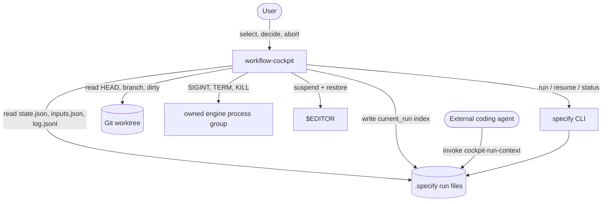

# 3. Context and Scope

| Field | Value |
|---|---|
| arc42 | 3. Context and Scope |
| Tier | 2 |

## Business context

The Cockpit sits between a user's terminal and an already initialized Spec Kit project. It shows
one run and owns that run's lifecycle; the workflow engine remains the only thing that actually
advances a workflow.

The engine is never modified. Cockpit's only write inside `.specify/` is the stable context index
at `.specify/workflows/runs/current_run`.

## Technical context

| Neighbor | Interface | Direction |
|---|---|---|
| `specify` CLI | `workflow run`, `workflow resume`, capability probes; argv without a shell | write |
| Persisted run files | `state.json`, `inputs.json`, `log.jsonl`, `workflow.yml` | read |
| Workflow catalog | `.specify/workflows/workflow-registry.json` | read |
| Git | `HEAD`, branch, dirty state via `GitService` | read |
| Engine process group | signals only while the owned child is verified live | signal |
| `$EDITOR` | suspend/restore Textual while paused at a gate | interactive |
| External agent | `cockpit-run-context` skill reads the context index only | read |

## External interfaces

- **Launch:** `workflow-cockpit [--project PATH]`; discovers the nearest Spec Kit project root.
- **Compatibility:** one resolved `specify` executable in the tested range (`>=1.0,<2.0`); refused
  outside it with install guidance.
- **Context index:** a Markdown index (not a snapshot) listing authoritative live sources for a
  user-chosen external agent.
- **Skill:** `cockpit-run-context` consumes only the context-index path and never invokes workflow
  lifecycle commands.

## Engine contract

Recorded against `specify 1.0.6.dev0` and applied to every build that passes the range check and
workflow capability probe; every row is covered by a Cockpit test or a code reference.

- **Version.** `specify --version` prints `specify <pep440>`. Tested range `>=1.0,<2.0`; prereleases
  in range are accepted, `0.16.1` and `2.0.0` are refused. Probes are non-mutating:
  `specify workflow --help` lists `run resume status list`, and `specify workflow run --help`
  lists `--input/-i` and `--json`.
- **Launch.** `specify workflow run <workflow_id> -i <name>=<value> ...` with **no shell**. `-i`
  values are strings the engine coerces. cwd is the selected canonical project root and
  `SPECIFY_INIT_DIR` is set to it on every child. `SPECKIT_WORKFLOW_RUN_ID` is used verbatim.
- **Run files.** `runs/<run_id>/` contains `workflow.yml` (written first), then atomic
  `state.json`/`inputs.json` (temp file + `os.replace`) and append-only `log.jsonl`. Cockpit
  refuses to spawn when the run directory already exists.
- **Gates.** `verdict_input` gates resume with `resume -i <name>=<choice> --json`; gates without it
  are answered by one write to the managed PTY. The recorded prompt contract applies to any
  supported engine, so interactive gates are not restricted to a single release. The engine exposes
  no abort command, so Abort uses signals.

Out of scope: workflow authoring/installation, built-in multi-run history, hosted services,
launching or managing coding agents, notifications, localization, and native Windows.
