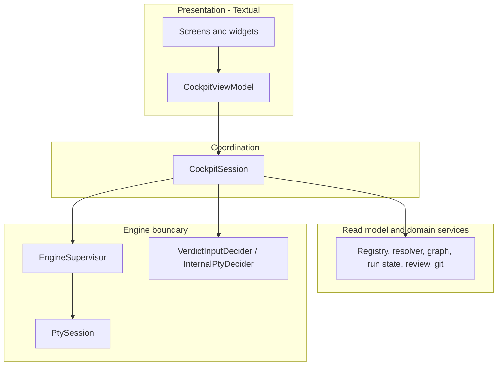

# 5. Building Block View

| Field | Value |
|---|---|
| arc42 | 5. Building Block View |
| Tier | 2 |

## Level 1: process

## Bootstrap and environment

| Component | Responsibility |
|---|---|
| `cli` | `workflow-cockpit` entry point, argument parsing (`--project`), skill installation, app startup; no config file. |
| `SkillInstaller` | Copy the bundled run-context skill into the project integration's skills directory at start; skip an existing directory; never fatal. |
| `ProjectDiscovery` | Locate the nearest Spec Kit project root from the current directory. |
| `Preflight` | Validate platform, Git worktree with `HEAD`, project initialization, and prerequisites with actionable errors. |
| `Compatibility` | Resolve and retain one `specify` executable; enforce `>=1.0,<2.0` and run non-mutating capability probes. |

## Engine boundary

| Component | Responsibility |
|---|---|
| `EngineSupervisor` | Validate the session's preallocated run ID; start or resume with the pinned executable; own/reap one process group; signal only a verified live group. |
| `PtySession` | Own the internal output PTY per output-producing command; non-blocking reads and complete-or-classified writes. |
| `OutputNormalizer` | Decode with replacement, normalize carriage returns, strip ANSI/control sequences, retain complete lines plus the partial line. |
| `VerdictInputDecider` | Structured gate decisions via `resume -i <name>=<choice> --json`. |
| `InternalPtyDecider` | Fallback gate decisions written once to the managed PTY. |

## Read model and domain services

| Component | Responsibility |
|---|---|
| `WorkflowRegistry` | Parse `workflow-registry.json` and list installed workflows. |
| `WorkflowDefinitionResolver` | Parse YAML and apply enabled overlays; provide effective launch inputs and steps. |
| `WorkflowDefinitionParser` | Turn the effective definition into declared control flow. |
| `ControlFlowGraph` | Generic graph of nodes, edges, branches, loops, gates, and overlays. |
| `RunStateReader` | Tolerant reads of independently written `state.json`, `inputs.json`, and `log.jsonl`; skip unchanged files while detecting atomic replacements. |
| `RunCatalog` | Bounded, read-only discovery of `.specify/workflows/runs/` into `RunDescriptor`s; never infers status and imports no engine internals. |
| `RunStore` | Delete one run directory under explicit single-owner safety: single path segment, no live owner, not the session's run, and not `running`/`initializing`. |
| `RunClaimStore` | Read, acquire, and release the single ownership claim of a run; liveness and stale/PID-reuse detection never signals a process. |
| `definition_from_launch_copy` | Build a `WorkflowDefinition` from the persisted launch-copy `workflow.yml`; authoritative for an adopted run's graph and gates. |
| `GraphProjector` | Combine the static graph with runtime state into status, active path, attempts, and timings. |
| `GitService` | Read `HEAD`, branch, and dirty state of the project worktree. |
| `FeatureReviewService` | Resolve the declared feature directory; list files; detect binary, large, and Markdown files; read current content. |
| `ContextIndexWriter` | Write the stable `current_run` context index after Start; a failure is reported but never interrupts the run. |
| `EditorLauncher` | Suspend and restore Textual around `$EDITOR` at a paused gate only. |

## Coordination

| Component | Responsibility |
|---|---|
| `CockpitSession` | Presentation facade that composes services; starts a new run, adopts an existing one, inspects an existing run read-only, or deletes a stale one; exposes one `submit_decision(choice, token)` seam. |
| `RunAdopter` | Orchestrate describe -> claim -> launch-copy definition for an existing paused run; binds identity and spawns nothing. |
| `GateDecisionCoordinator` | Project every current declared gate into one transport-independent `GateSnapshot`; own opaque tokens and write-once reconciliation, including the single adopted resume. |
| `PollingLoop` | Publish an immutable `RunSnapshot` on a 250 ms monotonic schedule. |
| `RunSnapshot` | Immutable view of status, graph projection, gate, review data, output tail, and outcome. |
| `SignalHandler` | On catchable `SIGINT`, `SIGHUP`, `SIGTERM`, attempt bounded best-effort abort without confirmation. |

## Presentation

| Component | Responsibility |
|---|---|
| `CockpitApp` | Textual application and screen routing. |
| Screens | Preflight, Launch, Cockpit, Confirm, Help; a resize guard replaces the layout below 88 x 36. |
| `HeaderRail` | Product, state, branch, elapsed, workflow, run ID, an `ADOPTED` marker for an adopted run, and a `VIEW ONLY` badge in inspect mode. |
| `ExistingRunsList` | Compact, subordinate launch-screen list of discovered run descriptors with an explicit empty state. |
| `Runway` | Scrollable control-flow graph with runtime overlay. |
| `Focus` | State, Files, Gate, and Outcome surfaces showing feature-file content. |
| `MarkdownDocumentView` | Read-only formatted rendering of Markdown feature files; other text keeps the plain viewer. |
| `EngineOutput` | Bounded, read-only `RichLog` fed from the supervisor. |
| `CommandRail` | Actions valid in the current state, including dynamic gate choices. |
| `CockpitViewModel` | Map `RunSnapshot` to renderable state; preserve selection, focus, and scroll across refreshes. |
| `ThemeBridge` | Map the resolved styling template to a registered Textual `Theme`. |

## Styling and shipped artifact

| Component | Responsibility |
|---|---|
| `StylingTemplate` | Immutable validated set of ten required token roles plus optional accents. |
| `TemplateRepository` | Data-only discovery of built-in and project-local templates; deterministic name/alias index. |
| `IntegrationDescriptor` | Tolerant read of `.specify/integration.json` `default_integration`; never raises. |
| `StylingResolver` | Resolve override -> integration -> `cockpit` default, with a non-fatal fallback notice. |
| `cockpit-skill` | Markdown skill for a user-chosen external agent; consumes only the context-index path; installed into the project integration at start. |

Source lives in `workflow_cockpit/{bootstrap,engine,services,session,ui,styling,skills}/`. The visual
prototype in `workflow_ui/prototype/` is not shipped.
