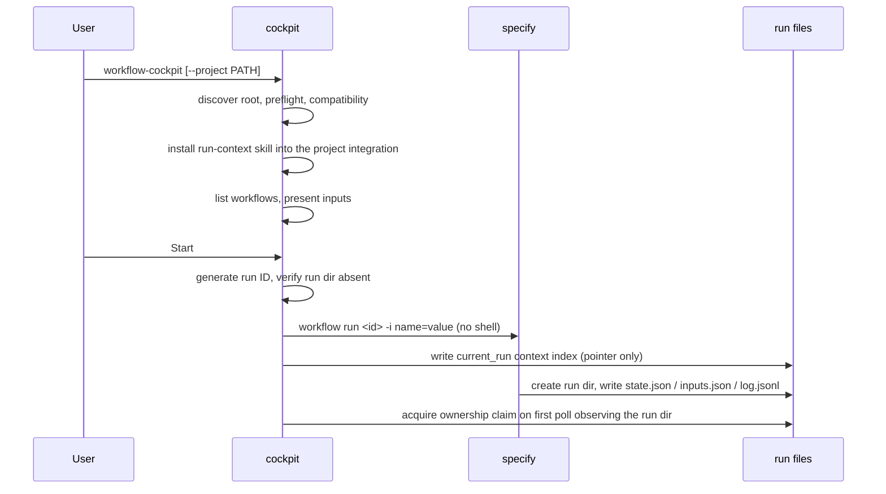
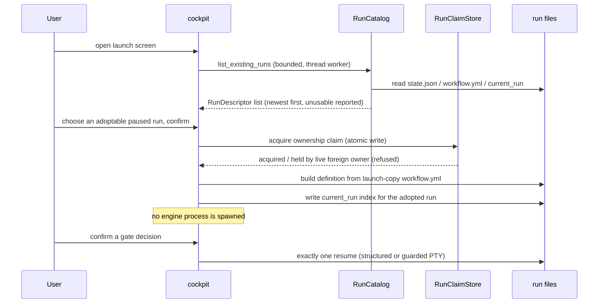
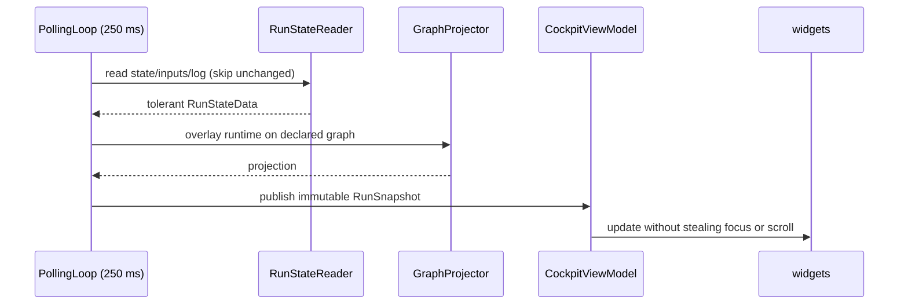
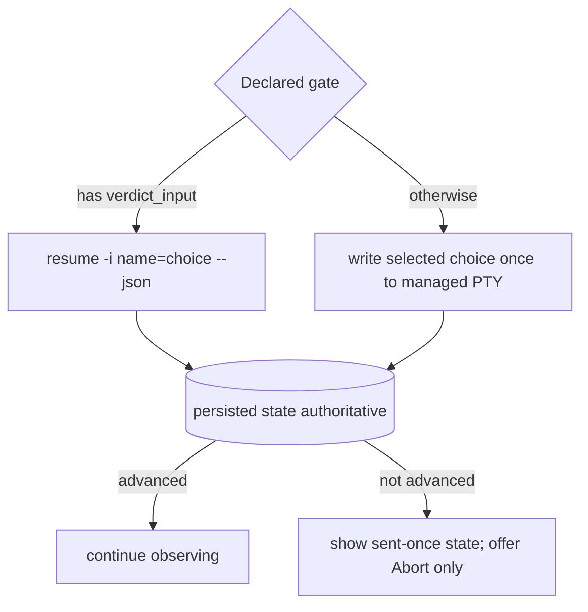
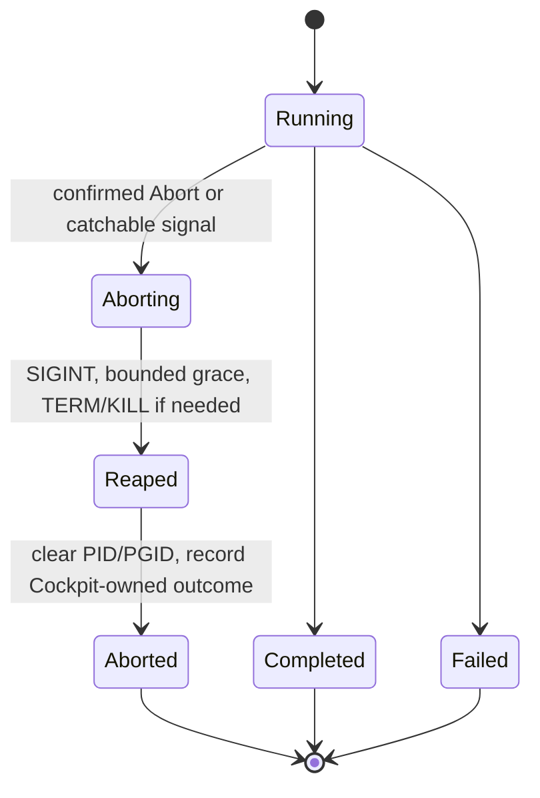

# 6. Runtime View

| Field | Value |
|---|---|
| arc42 | 6. Runtime View |
| Tier | 2 |

## Launch and start

Skill installation happens only for a real TUI start, not `--check`. A dirty worktree warns but does
not block Start. The run ID is allocated before spawn and passed through `SPECKIT_WORKFLOW_RUN_ID`;
directory scanning never claims ownership during Start. The context index is a pointer to the
authoritative sources, never a copy of them. Because the engine creates the run directory after
spawn, the ownership claim is written on the first poll that observes it; a clean close releases it.
Adoption is the explicit alternative: a bounded catalog plus a single-owner claim (below).

## Discover and adopt

Discovery is read-only and bounded by run count and per-file caps; a malformed run is reported
unusable with a reason, never hidden or assigned an inferred status. Adoption binds the existing run
ID and spawns nothing; a second live owner is refused and a stale claim from a crash is recovered
without signalling any process.

Alternatively, any usable run (including `running`, terminal, or foreign-owned runs) can be
inspected read-only without acquiring an ownership claim, binding a supervisor, or writing
`current_run`. In view-only mode, gate submission and abort are disabled.

## Delete a stale run

A confirmed delete on the launch screen calls `RunStore.delete`, which refuses a live-owned run, the
session's current run, a `running`/`initializing` run, and any target that is not a direct child of
`.specify/workflows/runs/`. On success it removes that one directory; `ContextIndexWriter` then clears
the `current_run` index if it named the deleted run. No process is signalled and nothing is deleted
without the confirmation ([ADR 0011](../decisions/0011-delete-run-directories.md)).

## Observe

`PtySession` streams output through `OutputNormalizer` into a bounded `RichLog`. `log.jsonl` remains
the complete source; output is diagnostic, not a second state model.

## Gate decision

The decide bar selects its affordance from the declared choice count: one to three choices render as equal-weight buttons, four or more render as one compact select box. Every declared choice is confirmed before dispatch. A PTY submission is sent at most once and never resent while state stays paused. Mixed, dynamic, loop/fan-out, and interactive-retry gate shapes are rejected before Start when deterministic prompt ownership cannot be proven.

## Abort and lifecycle

The engine exposes no abort command, so Cockpit sends SIGINT to the recorded engine process group.
A paused run whose command already exited is aborted locally with no signal. `SIGKILL`, host loss,
and power loss carry no cleanup guarantee.

## Process and state reconciliation

| Process | Persisted state | Cockpit interpretation |
|---|---|---|
| live | running/initializing | Running; continue polling and reading output. |
| reaped normally | paused | Paused with no signalable process; Abort only. |
| reaped | completed | Success after output drain and reap. |
| reaped | failed/aborted | Engine terminal result with persisted step/cause when available. |
| reaped | missing/nonterminal | Unexpected process death; preserve output tail and report failure. |
| live | any, after confirmed Abort | Aborting; signal only the verified owned group. |
| reaped | any, after Cockpit Abort began | Cockpit-aborted after cleanup completes. |

## Dogfooding workflow

Repository changes run through the published `spec-kit-extended-flow` Feature Flow installed from
GitHub:
`specify -> spec-gate -> plan -> plan-gate -> tasks -> analyze -> implement -> converge ->
documentation -> finish`. The documentation step invokes `speckit.extendedflow.documentation`,
which updates affected architecture documents in the same change. The final finish step gathers
context, removes the temporary feature artifacts, and leaves the engine-owned run directory intact.
See [§7 Deployment View](07-deployment-view.md).
