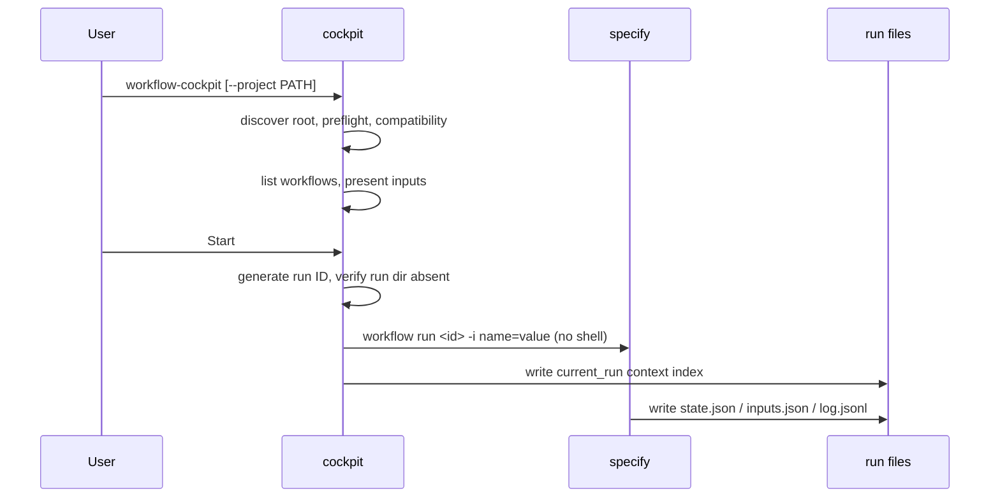
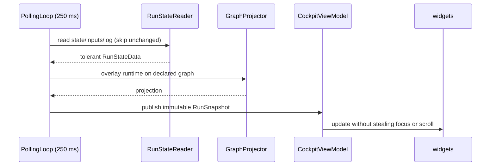
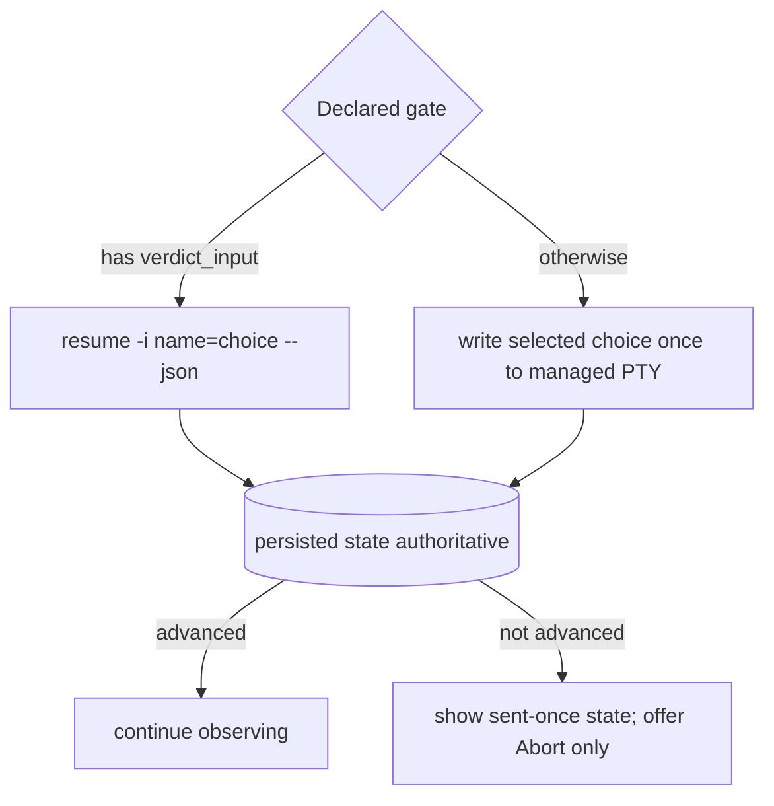
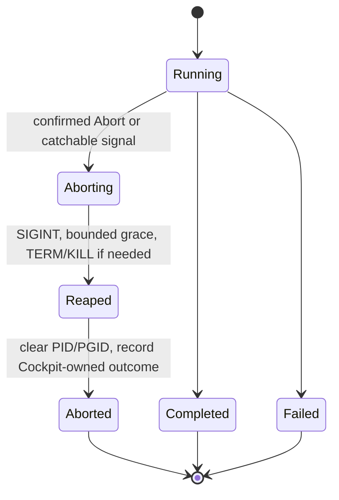

# 6. Runtime View

| Field | Value |
|---|---|
| arc42 | 6. Runtime View |
| Tier | 2 |

## Launch and start

A dirty worktree warns but does not block Start. The run ID is allocated before spawn and passed
through `SPECKIT_WORKFLOW_RUN_ID`; directory scanning never claims ownership.

## Observe

`PtySession` streams output through `OutputNormalizer` into a bounded `RichLog`. `log.jsonl` remains
the complete source; output is diagnostic, not a second state model.

## Gate decision

Every declared choice is confirmed before dispatch. A PTY submission is sent at most once and never
resent while state stays paused. Mixed, dynamic, loop/fan-out, and interactive-retry gate shapes
are rejected before Start when deterministic prompt ownership cannot be proven.

## Abort and lifecycle

The engine exposes no abort command, so Cockpit sends SIGINT to the recorded engine process group.
A paused run whose command already exited is aborted locally with no signal. `SIGKILL`, host loss,
and power loss carry no cleanup guarantee.

## Process and state reconciliation

| Process | Persisted state | Cockpit interpretation |
|---|---|---|
| live | running/initializing | Running; continue polling and reading output. |
| reaped normally | paused | Paused with no signalable process; Abort only. |
| reaped | completed | Success after output drain and reap. |
| reaped | failed/aborted | Engine terminal result with persisted step/cause when available. |
| reaped | missing/nonterminal | Unexpected process death; preserve output tail and report failure. |
| live | any, after confirmed Abort | Aborting; signal only the verified owned group. |
| reaped | any, after Cockpit Abort began | Cockpit-aborted after cleanup completes. |

## Dogfooding workflow

Repository changes run through `workflows/lean-flow/workflow.yml`:
`specify -> review-spec -> plan -> review-plan -> tasks -> implement -> update-documentation`. The
final step invokes the `arc42-context` extension command `speckit.arc42.update-docs`, which updates
the affected architecture documents in the same change. See [§7 Deployment View](07-deployment-view.md).
