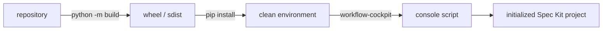

# 7. Deployment View

| Field | Value |
|---|---|
| arc42 | 7. Deployment View |
| Tier | 2 |

## Distribution

The repository has one `pyproject.toml` declaring the `workflow-cockpit` console script, bounded
Python/runtime dependencies, complete distribution metadata, a root MIT `LICENSE`, and packaged
Textual CSS. Its version is dynamic: `pyproject.toml` resolves `__version__` from
`workflow_cockpit/__init__.py`, which is the single editable source. `python -m build` produces an
sdist and wheel; an isolated smoke check installs the wheel and verifies the executable.



| Artifact | Contents |
|---|---|
| `workflow_cockpit` package | All runtime code and `ui/styles.tcss`. |
| Package data | `styling/templates/*.json`, `skills/cockpit-run-context/SKILL.md`. |
| Console script | `workflow-cockpit = workflow_cockpit.cli:main`. |

Repo-only tooling is deliberately not packaged: Extended Flow is installed into the target Spec Kit
project from its GitHub catalog, while `workflow_ui/prototype/` remains visual-only tooling.

## Project layout

```
AGENTS.md                     always-on agent context
docs/architecture/            arc42 sections (this set)
docs/decisions/               numbered ADRs
docs/glossary.md              pinned vocabulary
workflow_cockpit/             application source
tests/                        unit, textual, contract, pty, docs
scripts/setup-speckit.sh      Extended Flow bootstrap (GitHub by default)
workflow_ui/prototype/        visual-only prototype
```

A run deploys nothing: the application reads and writes inside the target project's
`.specify/` tree only.

## CI and platforms

`.github/workflows/test.yml` runs on every push and pull request. Its test matrix runs
`ruff check workflow_cockpit tests` and the full suite on `ubuntu-latest` and `macos-latest` for
Python 3.10, 3.11, and 3.12. A dependent distribution job builds both artifacts and installs the
wheel in a fresh virtual environment:

```bash
python -m pip install -e ".[test]"
ruff check workflow_cockpit tests
python -m pytest tests/unit tests/textual tests/contract tests/pty tests/docs -q
python -m build
python tests/release/smoke.py dist
```

`.github/workflows/release.yml` runs on `vMAJOR.MINOR.PATCH` tags. Maintainers cut a release with
`scripts/release.sh`, which bumps `__version__`, commits the bump on `main`, and pushes the matching
tag. The workflow re-verifies the tagged commit with the test workflow, refuses a tag that is not an
ancestor of `main` or that does not match the package version, rebuilds and smoke-installs the
artifacts, and publishes a GitHub Release with generated notes. GitHub is the distribution channel;
PyPI publishing is deliberately not configured.

The real-`specify` contract suite skips unless a pinned executable is provisioned; every other
suite is capability-gated. WSL uses the same command and is validated manually.
