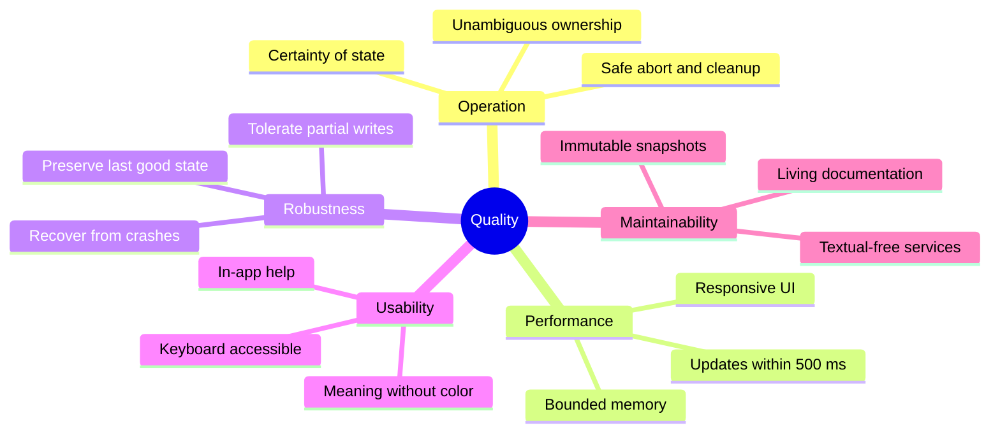

# 10. Quality Requirements

| Field | Value |
|---|---|
| arc42 | 10. Quality Requirements |
| Tier | 3 |

Reference material. Do not load automatically; read when evaluating quality trade-offs.

## Quality tree

## Quality scenarios

| ID | Scenario | Response | Measure |
|---|---|---|---|
| Q1 | Engine writes `state.json` while the user watches. | Poll publishes a new snapshot without stealing focus. | Visible update within 500 ms. |
| Q2 | `log.jsonl` grows to gigabytes. | Reads are capped and output is bounded. | No poll stalls; memory bounded. |
| Q3 | A state file is truncated mid-write. | Reader keeps the last good value and marks it stale. | UI does not crash. |
| Q4 | The engine process dies unexpectedly. | Failure is reported with the output tail and cause. | Failure surfaced, no second state model. |
| Q5 | User closes during a run. | Confirmed Abort interrupts the owned group. | No Cockpit-owned process left running. |
| Q6 | Terminal narrows below 88 x 36. | A reversible resize guard replaces the layout. | No clipping; app does not exit. |
| Q7 | A documentation change alters a constraint. | The matching doc updates in the same commit. | Link/structure tests pass. |

## Verification

- Unit tests cover parsing, projection, feature-file listing, compatibility, supervisor
  transitions, normalization, and decision selection.
- Textual `App.run_test()` covers screens, focus, modes, confirmation, and outcomes.
- Subprocess/PTY integration covers success, both gate paths, branch creation, retry/skip,
  no-change, no-gate, failure, abort, and termination signals.
- `tests/docs/` covers structure, links, format, budget, and ADR integrity.

Demo fixtures cover linear success, `verdict_input`, interactive PTY gates, branch creation,
retry/skip, no-change gates, no-gate runs, failure, and abort.
